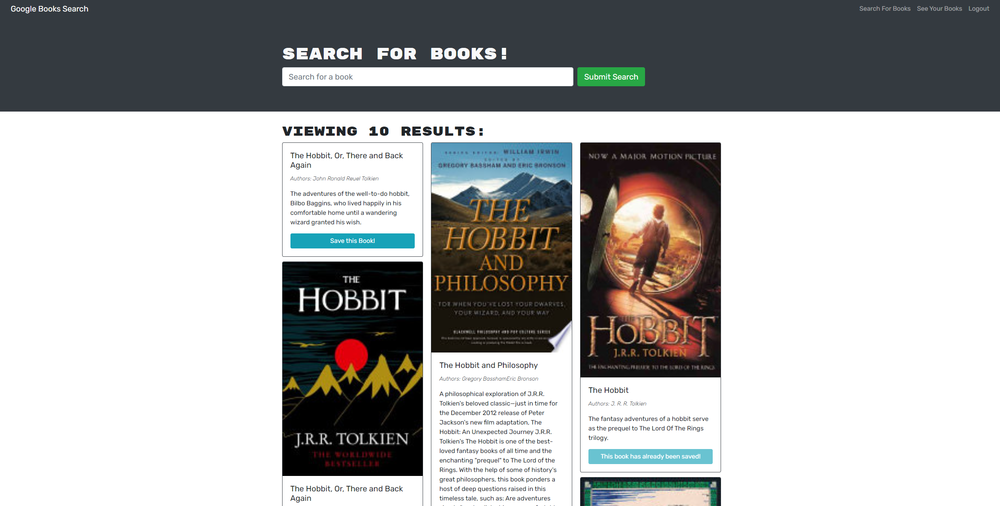

# Book Search Engine
## Table of Contents
 - [Description](#description)
 - [Usage and Installation](#usage-and-installation)
 - [Demo](#demo)
## Description
This application is a book search engine using the Google Books API. It was initially built with a RESTful API, but I have refactored it to use the GraphQL API. It is a great tool for avid readers who want to search for new books to read and keep track of it, much like a wishlist.

## Usage and Installation
To use this application, simply visit this <a href='https://book-search-engine-ghassan.herokuapp.com/'>link</a>.
Alternatively, you can follow the following instructions:
  1. Click the green code button and copy the SSH link.
  2. In your terminal, navigate to your desired directory.
  3. Type `git clone` and paste the SSH link.
  4. After cloning the repo, cd into the directory.
  5. Run the application by running the command `npm run develop`.
## Demo

